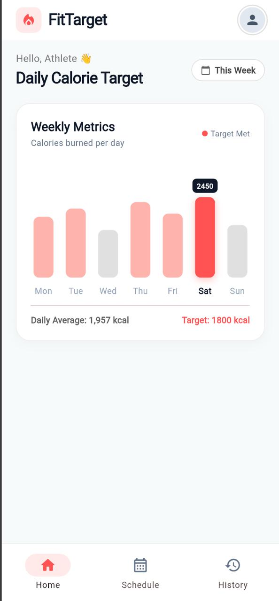
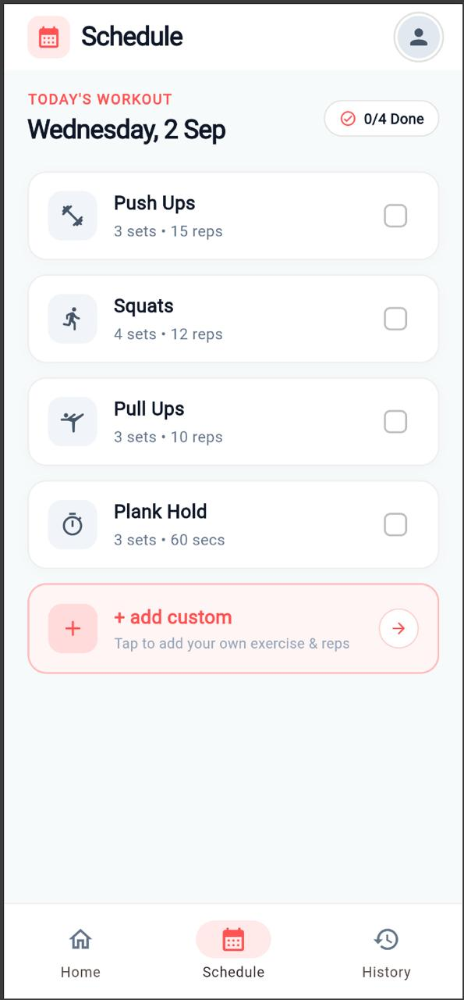
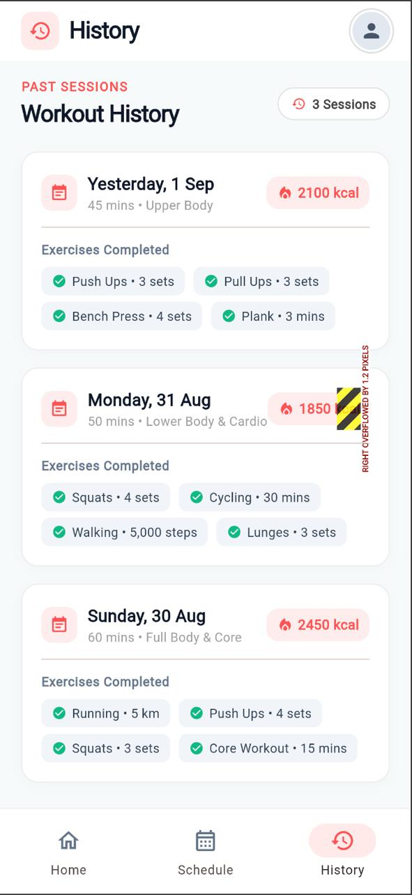
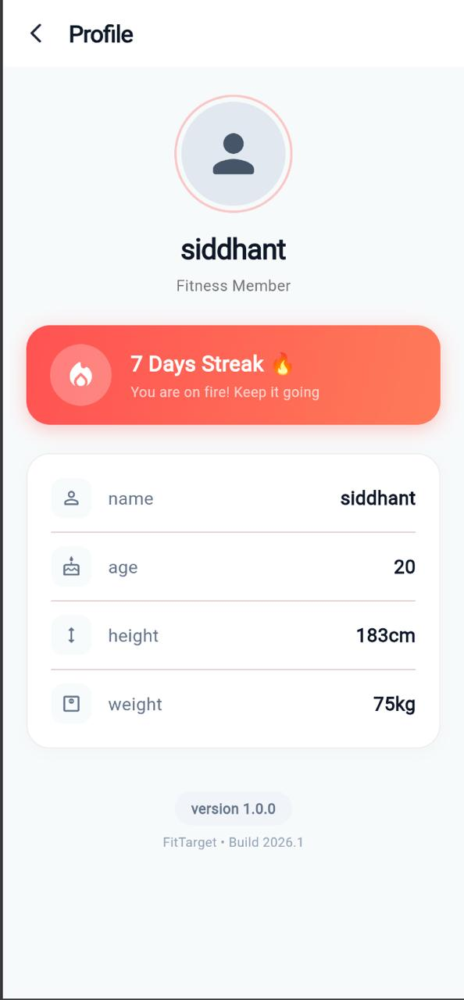

# FitTarget 🏋️‍♂️🔥

> **FitTarget** is a sleek, modern Flutter fitness tracking application designed to streamline daily workouts. It features interactive weekly calorie analytics, an interactive daily exercise schedule with custom workout creation, comprehensive past workout history logs, and a dedicated profile tracker with active streaks to keep athletes consistent, motivated, and achieving goals.

---

## 📱 App Screenshots

<div align="center">
  <table>
    <tr>
      <td align="center" width="25%">
        <b>🏠 Home Screen</b><br/><br/>
        
      </td>
      <td align="center" width="25%">
        <b>📅 Schedule Screen</b><br/><br/>
        
      </td>
      <td align="center" width="25%">
        <b>📜 History Screen</b><br/><br/>
        
      </td>
      <td align="center" width="25%">
        <b>👤 Profile Screen</b><br/><br/>
        
      </td>
    </tr>
  </table>
</div>

---

## ✨ Key Features

### 1. 🏠 Home — Weekly Calorie Target & Analytics
- **Interactive Weekly Bar Chart**: Visualizes daily calorie burn against target goal (1,800 kcal).
- **Day Selector**: Tap on any bar (Mon–Sun) to inspect exact calories and completion status.
- **Minimalist Light Theme**: Sleek, distraction-free cards with soft shadows and curated coral accents.

### 2. 📅 Schedule — Daily Workout Checklist & Custom Exercises
- **Dynamic Date Header**: Displays today's formatted date and real-time completion counter (`X/Y Done`).
- **Interactive Exercise Checklist**:
  - Push Ups (3 sets • 15 reps)
  - Squats (4 sets • 12 reps)
  - Pull Ups (3 sets • 10 reps)
  - Plank Hold (3 sets • 60 secs)
- **Interactive Checkboxes**: Mark exercises done with clean strike-through feedback.
- **`+ add custom` Exercise**: Open modal bottom sheet to dynamically add your own exercise and sets/reps.

### 3. 📜 History — Past Workout Sessions
- **Untappable Rounded Cards**: Displays recent session logs cleanly.
  - **Yesterday, 1 Sep**: 45 mins • Upper Body (2,100 kcal)
  - **Monday, 31 Aug**: 50 mins • Lower Body & Cardio (1,850 kcal)
  - **Sunday, 30 Aug**: 60 mins • Full Body & Core (2,450 kcal)
- **Tag Badges**: Itemized list of completed movements per session with calorie badges.

### 4. 👤 Profile — Member Metrics & Active Streaks
- **Member Information**:
  - Name: `siddhant`
  - Age: `20`
  - Height: `183cm`
  - Weight: `75kg`
- **Streak Fire Card**: Eye-catching fire banner tracking active workout streaks (`7 Days Streak 🔥`).
- **App Versioning**: `version 1.0.0` Build 2026.1.

---

## 🛠️ Tech Stack

- **Framework**: Flutter 3.x / Dart 3.x
- **UI Architecture**: Material 3 Design with custom typography, responsive layout, and soft elevation.
- **State Management**: State-driven navigation and reactive checklist state.

---

## 🚀 Getting Started

### Prerequisites
- [Flutter SDK](https://docs.flutter.dev/get-started/install) installed.
- iOS Simulator, Android Emulator, or a connected physical device / Chrome browser.

### Run the App
```bash
# Clone or navigate to the project directory
cd project2

# Get dependencies
flutter pub get

# Run on your connected device
flutter run -t lib/FitTarget.dart
```

---

## 📁 Project Structure

```
project2/
├── lib/
│   ├── FitTarget.dart       # Main FitTarget Application & UI views
│   └── main.dart            # App entry point
├── screenshots/             # 📸 Place your app screenshots here
│   ├── home.png
│   ├── schedule.png
│   ├── history.png
│   └── profile.png
├── pubspec.yaml             # Project dependencies & configurations
└── README.md                # Project documentation
```

---

## 📄 License

This project is licensed under the MIT License.
